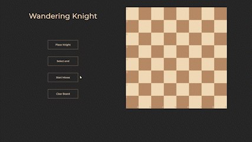

# Knights-Travails

  

## Description

This project is a web-based chessboard application that calculates the shortest path for a knight to move from a start position to an end position on the board. It visualizes the path and displays the number of moves required.

## Features

- Interactive chessboard interface
- Select the start and end positions for the knight's movement
- Calculates and highlights the shortest path using knight moves
- Displays the number of moves required to reach the destination
- Responsive design for various screen sizes

## Technologies Used

- HTML
- CSS
- JavaScript
- Webpack

## Installation

1. Clone the repository: `git clone https://github.com/YotamOfri/Knights-Travails.git`
2. Open the project directory: `cd chessboard-shortest-path`
3. Open `index.html` in your preferred web browser.

## Usage

1. Open the web application in your browser.
2. Click on the chessboard squares to select the start and end positions.
3. The shortest path will be calculated and displayed on the board.
4. The number of moves required will be shown.
5. To find a new path, simply click on new start and end positions.
